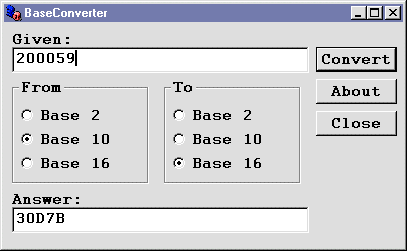



## BaseConverter

### Description

This application converts numbers from one base to another. Namely binary, decimal and hexadecimal numbers.
 
### More Info
 

             |
---                |---
**Submitted On**   |2000-07-04 01:37:40
**By**             |[Vincent GW Lewis](https://github.com/Planet-Source-Code/PSCIndex/blob/master/ByAuthor/vincent-gw-lewis.md)
**Level**          |Beginner
**User Rating**    |4.1 (29 globes from 7 users)
**Compatibility**  |VB 3\.0, VB 4\.0 \(16\-bit\), VB 4\.0 \(32\-bit\), VB 5\.0, VB 6\.0, VB Script, ASP \(Active Server Pages\) 
**Category**       |[Complete Applications](https://github.com/Planet-Source-Code/PSCIndex/blob/master/ByCategory/complete-applications__1-27.md)
**World**          |[Visual Basic](https://github.com/Planet-Source-Code/PSCIndex/blob/master/ByWorld/visual-basic.md)
**Archive File**   |[CODE\_UPLOAD7423742000\.zip](https://github.com/Planet-Source-Code/vincent-gw-lewis-baseconverter__1-9491/archive/master.zip)

